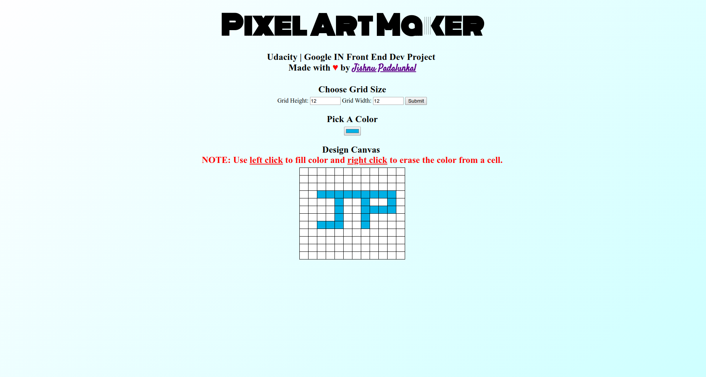

# Pixel Art Maker Project

## Project Purpose:

This web page was built for the Udacity Front End Nanodegree Program. The purpose of the project is to demonstrate understanding of JavaScript and HTML  event listeners by building a single-page web app that allows users to draw pixel art on a customizable canvas.

## How to Load the App
You can run a hosted version of the app at [https://codepen.io/jishnup/pen/OZpwXN](https://codepen.io/jishnup/pen/OZpwXN)

To run a local copy, clone or download the code repository at [https://github.com/jishnujayakumar/udacity-pixel-art-maker.git](https://github.com/jishnujayakumar/udacity-pixel-art-maker.git). If downloaded, unzip the folder and run `index.html` in your favorite browser.

## How to Use the App
1. Set the canvas size using the width and height input selects boxes.  When finished, click on submit.
2. Choose a color from the color picker input box.
3. Click on any box in the grid to change that boxes color.
4. Repeat steps 2 and 3 until your design is complete.

Have fun!

### Resources and Documentation:
* [MDN > `<input type="color">`](https://developer.mozilla.org/en-US/docs/Web/HTML/Element/input/color)
* [MDN > `EventTarget.addEventListener()`](https://developer.mozilla.org/en-US/docs/Web/API/EventTarget/addEventListener)

### Udacity Resources:
* [Udacity JavaScript Basics Course](https://www.udacity.com/course/javascript-basics--ud804)
* [Project Overview](https://classroom.udacity.com/nanodegrees/nd001/parts/9e34624d-cdc8-4cd7-9d7e-78943413e645/modules/86dad2ab-1bb7-4c90-bf91-2d0a90e0ab03/lessons/67c36bb7-3dc7-4c17-a971-05eebbfc31bc/concepts/9c749ac2-1268-4e57-b2e4-6e8f5d77116d_)
* [Starter Code](https://github.com/udacity/project-pixel-art-maker-starter)
* [Project Rubric](https://review.udacity.com/#!/rubrics/641/view)

### README credits
* [Sarah-Maris](https://github.com/sarah-maris/udacity-pixel-art)
